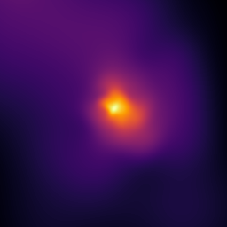

.. image:: https://github.com/SWIFTSIM/swiftgalaxy/raw/main/swiftgalaxy_banner.png
   :width: 100%
   :alt: Banner with logo showing a swift in a spiral and the text SWIFTGalaxy.

|Python version| |PyPI version| |JOSS| |pyOpenSci| |ASCL| |Repostatus| |Zenodo| |Build status| |Documentation status| |codecov| |Ruff|

.. |Build status| image:: https://github.com/SWIFTSIM/swiftgalaxy/actions/workflows/lint_and_test.yml/badge.svg
    :target: https://github.com/SWIFTSIM/swiftgalaxy/actions/workflows/lint_and_test.yml
    :alt: Build Status
.. |Documentation status| image:: https://readthedocs.org/projects/swiftgalaxy/badge/?version=latest
    :target: https://swiftgalaxy.readthedocs.io/en/latest/?badge=latest
    :alt: Documentation Status
.. |Python version| image:: https://img.shields.io/python/required-version-toml?tomlFilePath=https%3A%2F%2Fraw.githubusercontent.com%2FSWIFTSIM%2Fswiftgalaxy%2Fmain%2Fpyproject.toml
   :alt: Python Version from PEP 621 TOML
.. |PyPI version| image:: https://img.shields.io/pypi/v/swiftgalaxy
   :target: https://pypi.org/project/swiftgalaxy/
   :alt: PyPI - Version
.. |Repostatus| image:: https://www.repostatus.org/badges/latest/active.svg
   :target: https://www.repostatus.org/#active
   :alt: Project Status: Active – The project has reached a stable, usable state and is being actively developed.
.. |codecov| image:: https://codecov.io/gh/SWIFTSIM/swiftgalaxy/graph/badge.svg?token=YV3YYEK78Z 
   :target: https://codecov.io/gh/SWIFTSIM/swiftgalaxy
   :alt: CodeCov status
.. |Zenodo| image:: https://zenodo.org/badge/488271795.svg
   :target: https://doi.org/10.5281/zenodo.15502355
   :alt: Zenodo DOI
.. |ASCL| image:: https://img.shields.io/badge/ascl-2505.002-blue.svg?colorB=262255
   :target: https://ascl.net/2505.002
   :alt: ascl:2505.002
.. |pyOpenSci| image:: https://pyopensci.org/badges/peer-reviewed.svg
   :target: https://github.com/pyOpenSci/software-submission/issues/244
   :alt: pyOpenSci Peer-Reviewed
.. |Ruff| image:: https://img.shields.io/endpoint?url=https://raw.githubusercontent.com/astral-sh/ruff/main/assets/badge/v2.json
    :target: https://github.com/astral-sh/ruff
    :alt: Ruff
.. |JOSS| image:: https://joss.theoj.org/papers/10.21105/joss.09278/status.svg
   :target: https://doi.org/10.21105/joss.09278
   :alt: JOSS doi:10.21105/joss.09278

.. INTRO_START_LABEL

SWIFTGalaxy is an open-source astrophysics module that extends SWIFTSimIO_ tailored to analyses of particles belonging to individual galaxies simulated with SWIFT_. It inherits from and extends the functionality of the ``SWIFTDataset``. It understands the content of halo catalogues (supported: `Velociraptor`_, `Caesar`_, `SOAP`_) and therefore which particles belong to a galaxy or other group of particles, and its integrated properties. The particles occupy a coordinate frame that is enforced to be consistent, such that particles loaded on-the-fly will match e.g. rotations and translations of particles already in memory. Intuitive masking of particle datasets is also enabled. Utilities to make working in cylindrical and spherical coordinate systems more convenient are also provided. Finally, tools to iterate efficiently over multiple galaxies are also provided.

.. _SWIFTSimIO: http://swiftsimio.readthedocs.org
.. _SWIFT: https://swift.strw.leidenuniv.nl/
.. _Velociraptor: https://ui.adsabs.harvard.edu/abs/2019PASA...36...21E/abstract
.. _Caesar: https://caesar.readthedocs.io/en/latest/
.. _SOAP: https://github.com/SWIFTSIM/SOAP

.. INTRO_END_LABEL

Installation_ is as simple as ``pip install swiftgalaxy``.

To install optional dependencies to support Velociraptor catalogues use ``pip install swiftgalaxy[velociraptor]``. For Caesar support use:

.. code-block::

   pip install git+https://github.com/dnarayanan/caesar.git

No additional dependencies are needed for reading SOAP catalogues. If you want to generate example input files for SOAP, you should install:

.. code-block::

   pip install git+https://github.com/SWIFTSIM/soap.git
   
.. _Installation: https://swiftgalaxy.readthedocs.io/en/latest/getting_started/index.html#installing

.. EXAMPLE_START_LABEL

Once installed, creating a ``SWIFTGalaxy`` object to get started with analysis is simple! For instance, for a SWIFT simulation with a SOAP-format halo catalogue (an example - 300 MB - will be automatically downloaded):

.. code-block:: python

   from swiftgalaxy import SWIFTGalaxy, SOAP
   from swiftgalaxy.demo_data import web_examples

   sg = SWIFTGalaxy(
       web_examples.virtual_snapshot,
       SOAP(web_examples.soap, soap_index=0)
   )

   # access data for particles belonging to the galaxy:
   sg.gas.temperatures

   # access integrated properties from the halo catalogue
   sg.halo_catalogue.spherical_overdensity_200_crit.soradius

   # automatically generated spherical/cylindrical coordinates:
   sg.gas.spherical_coordinates.r

   # consistent coordinate transformations of all particles, even those not loaded yet:
   from scipy.spatial.transform import Rotation
   sg.rotate(Rotation.from_euler("x", 90, degrees=True))

   # compatible with swiftsimio visualisation:
   import numpy as np
   import unyt as u
   from swiftsimio import cosmo_array
   from swiftsimio.visualisation import project_gas
   import matplotlib.pyplot as plt
   img = project_gas(
       sg,
       periodic=False,
       resolution=256,
       region=cosmo_array(
           [-30, 30, -30, 30],
	   u.kpc,
	   comoving=True,
	   scale_factor=sg.metadata.a,
	   scale_exponent=1
       ),
   )
   plt.imsave("eagle6_galaxy.png", np.log10(img.T), origin="lower", cmap="inferno")

.. EXAMPLE_END_LABEL

Examples
--------

.. EXAMPLES_START_LABEL

More usage examples can be found in the `examples folder on github`_.

.. _examples folder on github: https://github.com/SWIFTSIM/swiftgalaxy/tree/main/examples

.. EXAMPLES_END_LABEL

+ `Quick start guide`_
+ `Full documentation`_

.. _Quick start guide: https://swiftgalaxy.readthedocs.io/en/latest/getting_started
.. _Full documentation: https://swiftgalaxy.readthedocs.io/en/latest
   
Citing SWIFTGalaxy
------------------

.. CITING_START_LABEL

If your use of SWIFTGalaxy leads to a publication, please cite the `JOSS paper`_ (`ADS listing`_). You may also cite the `swiftgalaxy entry`_ in the ASCL_ (`indexed on ADS`_). Ideally specify the version used (`Zenodo DOI`_, git commit ID and/or version number) and link to the github repository.

.. code-block:: bibtex

    @ARTICLE{2025JOSS...10.9278O,
        author = {{Oman}, Kyle A.},
        title = "{SWIFTGalaxy: a Python package to work with particle groups from SWIFT simulations}",
        journal = {The Journal of Open Source Software},
        keywords = {astronomy, simulations},
        year = 2025,
        month = oct,
        volume = {10},
        number = {114},
        eid = {9278},
        pages = {9278},
        doi = {10.21105/joss.09278},
        adsurl = {https://ui.adsabs.harvard.edu/abs/2025JOSS...10.9278O},
        adsnote = {Provided by the SAO/NASA Astrophysics Data System}
    }
    
    @MISC{
        2025ascl.soft05002O,
     	author = {{Oman}, Kyle A.},
        title = "{swiftgalaxy}",
        keywords = {Software},
        howpublished = {Astrophysics Source Code Library, record ascl:2505.002},
        year = 2025,
        month = may,
        eid = {ascl:2505.002},
        pages = {ascl:2505.002},
        archivePrefix = {ascl},
        eprint = {2505.002},
        adsurl = {https://ui.adsabs.harvard.edu/abs/2025ascl.soft05002O},
        adsnote = {Provided by the SAO/NASA Astrophysics Data System}
    }

Please also consider the `citations requested for SWIFTSimIO <citeSWIFTSimIO>`_.

.. _JOSS paper: https://doi.org/10.21105/joss.09278
.. _ADS listing: https://ui.adsabs.harvard.edu/abs/2025JOSS...10.9278O
.. _swiftgalaxy entry: https://ascl.net/2505.002
.. _ASCL: https://ascl.net
.. _indexed on ADS: https://ui.adsabs.harvard.edu/abs/2025ascl.soft05002O
.. _Zenodo DOI: https://zenodo.org/records/15502385
.. _citeSWIFTSimIO: https://swiftsimio.readthedocs.io/en/latest/index.html#citing-swiftsimio

.. CITING_END_LABEL

Community
---------

.. COMMUNITY_START_LABEL

Code contributions are very welcome! A good place to start is the `contributing guide`_ and how to set up a `development environment`_.

SWIFTGalaxy is licensed under `GPL-3.0`_ and community members are expected to abide by the `code of conduct`_.

.. _contributing guide: https://github.com/SWIFTSIM/swiftgalaxy/blob/main/CONTRIBUTING.md
.. _development environment: https://swiftgalaxy.readthedocs.io/en/latest/getting_started/index.html#installing
.. _GPL-3.0: https://github.com/SWIFTSIM/swiftgalaxy/tree/main?tab=GPL-3.0-1-ov-file
.. _code of conduct: https://github.com/SWIFTSIM/swiftgalaxy/tree/main?tab=coc-ov-file

.. COMMUNITY_END_LABEL
